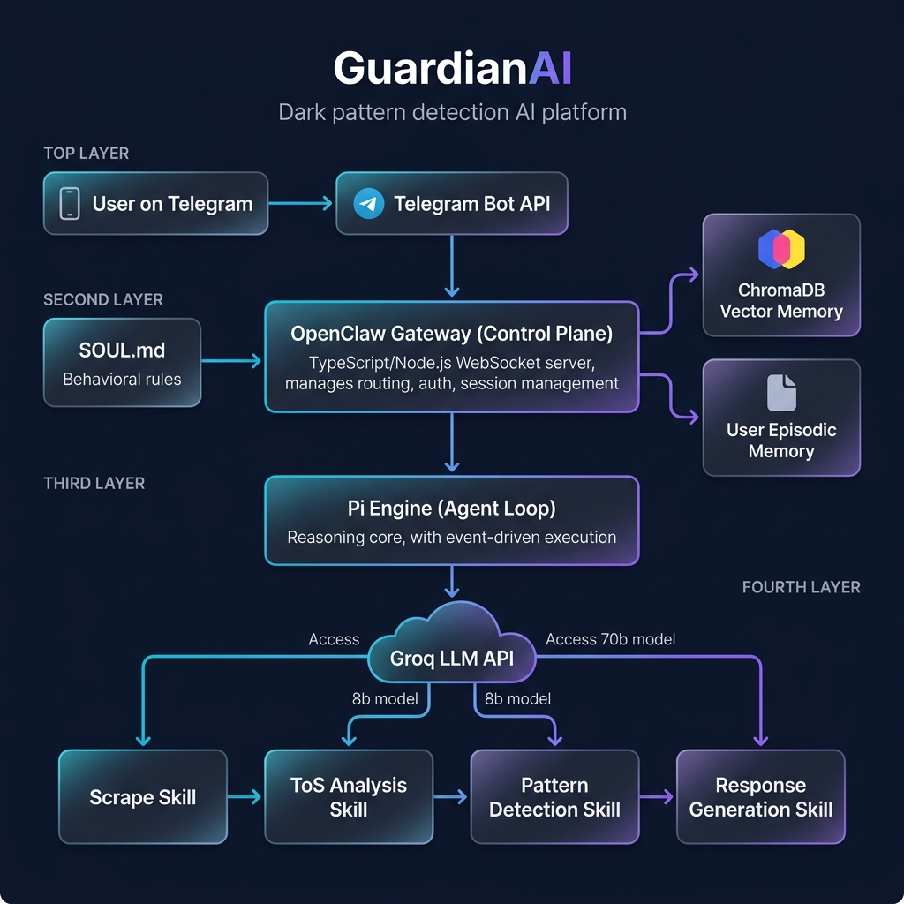
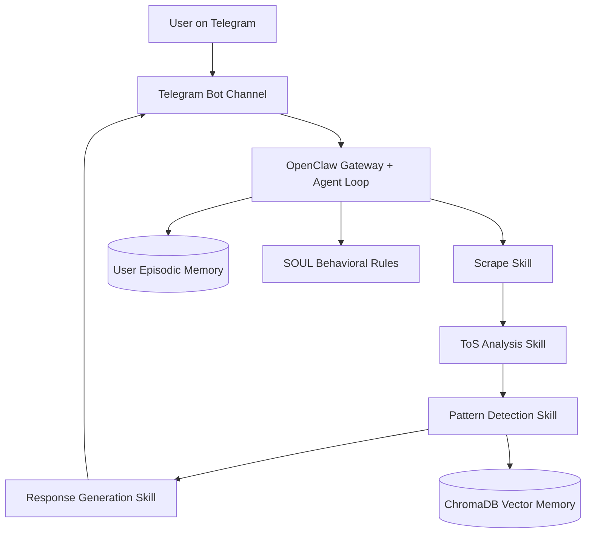
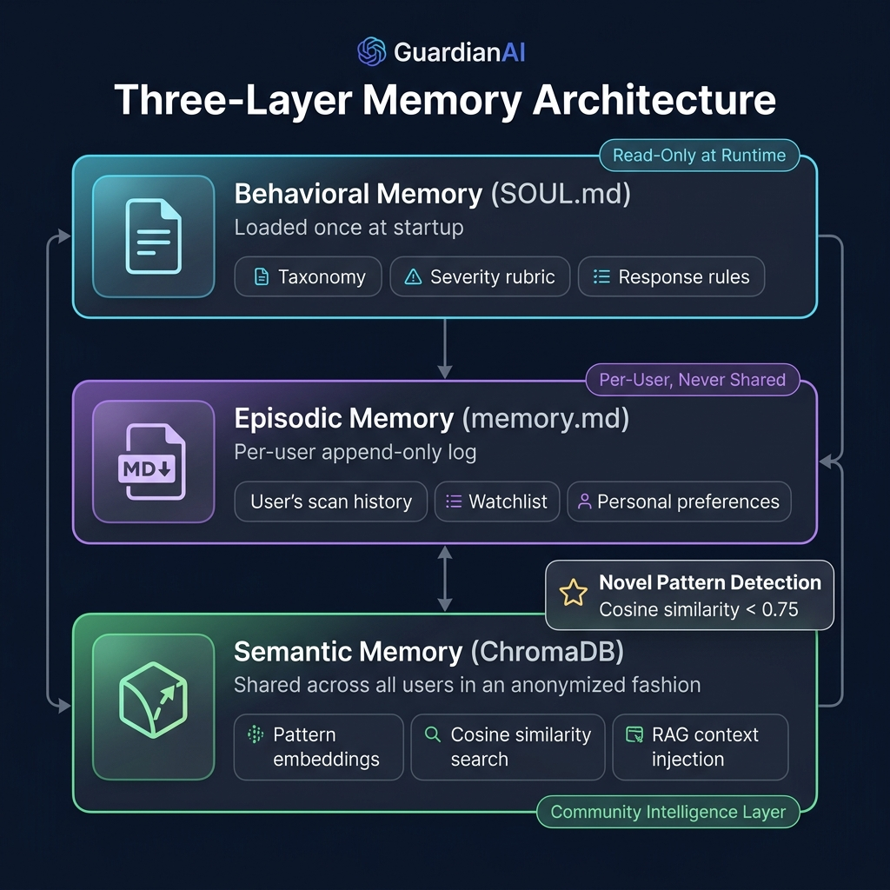
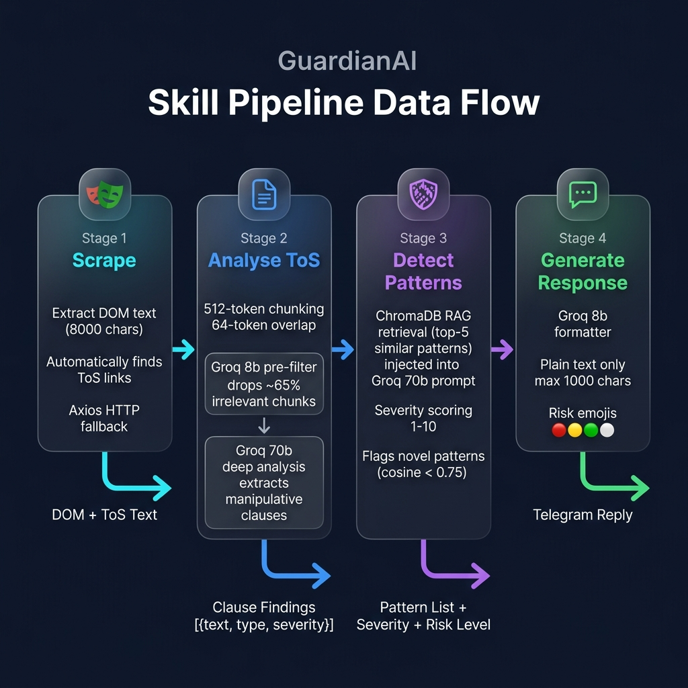
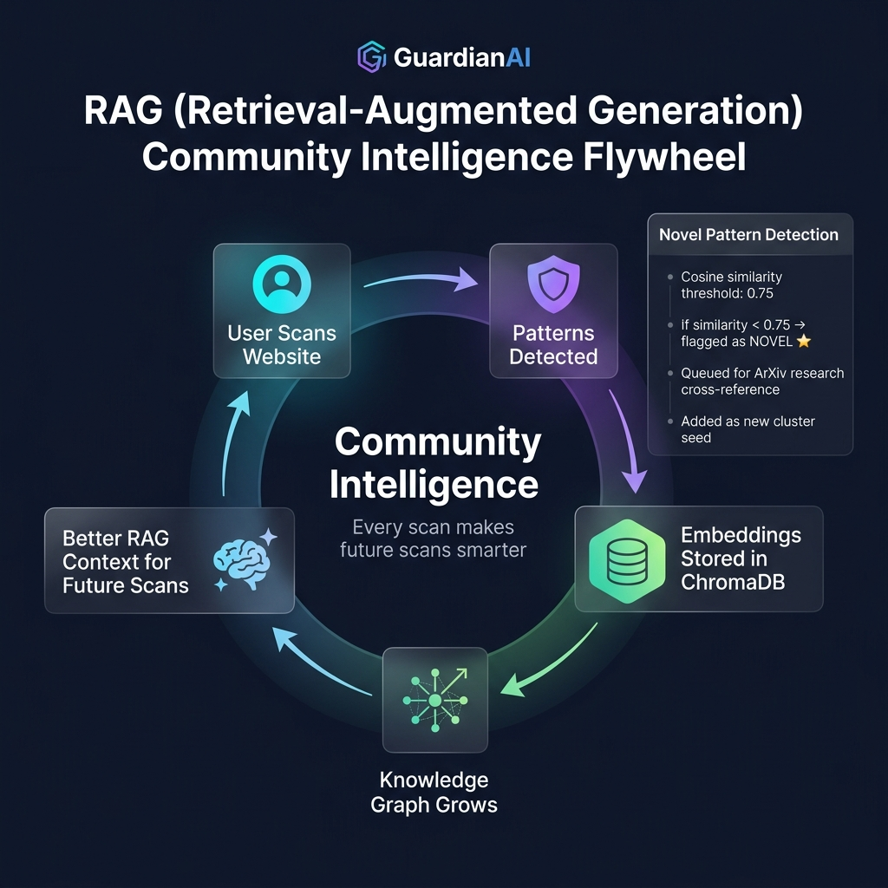
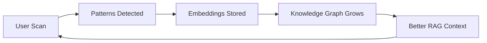
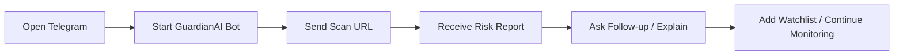
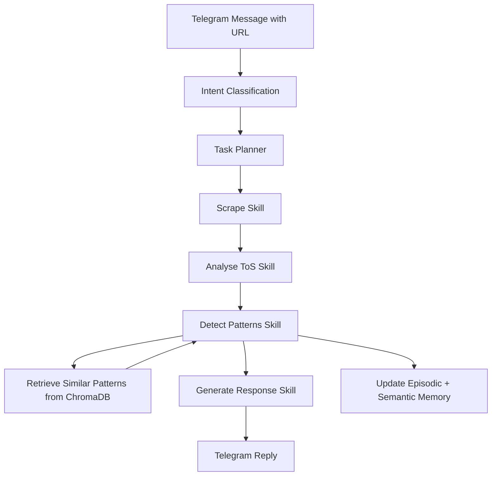
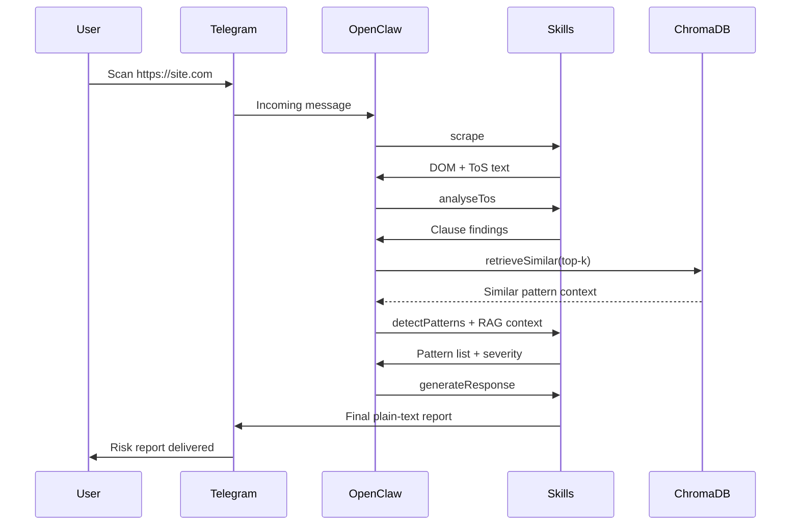

# 🛡 GuardianAI — Detailed Product, Research, and Architecture README
### Telegram-based dark pattern detection and community intelligence platform

> **Channel note:** GuardianAI uses **Telegram** as the user channel (not WhatsApp).

---

## At-a-glance summary

| Dimension | Details |
|---|---|
| Product | AI assistant for dark pattern detection in UI + ToS |
| User interface | Telegram bot + OpenClaw pipeline |
| Core pipeline | `scrape -> analyseTos -> detectPatterns -> generateResponse` |
| AI backbone | Groq LLMs + ChromaDB RAG |
| Differentiator | Deterministic skill chain + shared community memory |

---

## 1. Tagline (one-liner of our idea)
**GuardianAI helps people spot deceptive design before they pay, subscribe, or share data.**

GuardianAI is a conversational AI agent that takes a single URL from a user, performs multi-layered analysis of both the visible interface and the legal fine print, and returns an actionable risk assessment — all inside a Telegram chat. It transforms complex, hidden manipulation into simple, understandable warnings that anyone can act on.

## 2. Why we selected this theme (GenAI research)
We selected this theme because dark patterns are contextual, dynamic, and often hidden in mixed UI + legal content. Traditional static heuristics miss nuance (tone, pressure language, consent framing, buried clauses). GenAI enables:
1. **Cross-modal reasoning over interface text and legal text** — A single LLM call can correlate a "Subscribe Now" button's urgency with a ToS clause that locks users into 12-month billing. No rule-based system can perform this cross-domain inference.
2. **Structured extraction of manipulative signals** — GenAI can output structured JSON taxonomies (type, severity, evidence) from unstructured natural language, enabling downstream scoring and storage without manual labeling.
3. **Adaptive learning through retrieval of semantically similar historical cases** — By embedding detected patterns into a vector database, the system builds a growing library of real-world examples. RAG injection means the LLM doesn't just classify in isolation — it compares against every pattern ever seen across all users.

This makes the solution suitable for both practical user protection and ongoing research discovery.

## 3. What problem are we solving
Users are manipulated by dark patterns such as:
1. **Hidden costs at checkout** — Fees, taxes, or service charges that only appear at the final payment step after the user has invested time in the purchase flow
2. **Forced continuity and cancellation friction** — Auto-renewal clauses buried in ToS, combined with multi-step cancellation flows designed to discourage users from leaving
3. **Consent tricks and privacy misdirection** — Pre-checked opt-in boxes, confusing double-negatives ("Uncheck to not receive..."), and data-sharing agreements disguised as mandatory fields
4. **Urgency/pressure tactics and misleading social proof** — Fake countdown timers, fabricated "only 2 left!" warnings, and manufactured review counts that create artificial urgency

These patterns cause users to make decisions they would not make under transparent design. The financial and privacy harm is real, measurable, and growing as digital commerce expands.

## 4. Who faces it (persona)
| Persona | Situation | Risk | How GuardianAI Helps |
|---|---|---|---|
| Student buyer | Fast online purchase during time pressure | Hidden fees, auto-renew traps | Scans checkout page, flags hidden cost progression before payment |
| Freelancer / founder | Subscribes to SaaS tools frequently | Forced continuity, difficult cancellation | Identifies lock-in clauses in ToS, warns about cancellation friction |
| Family decision-maker | Uses gaming/entertainment apps | Urgency manipulation, deceptive upsells | Detects fake scarcity signals and manipulative upsell flows |
| General consumer | Accepts terms quickly on mobile | Buried consent and legal disadvantage | Extracts and scores high-risk ToS clauses in plain language |

## 5. Why is it important
This matters because dark patterns create:
1. **Direct financial harm** — Unintended recurring charges, hidden fees, and auto-renewals that collectively cost consumers billions annually
2. **Privacy harm** — Excessive data-sharing consent obtained through confusing UI flows, leading to personal information being sold without informed agreement
3. **Trust erosion** — Repeated exposure to deceptive design erodes consumer trust in digital products, harming legitimate businesses alongside bad actors
4. **Information asymmetry** — Platforms have teams of lawyers and UX designers optimizing for conversion; users have seconds to decide, often on a small mobile screen

## 6. Existing solutions (if any)
Current alternatives include:
1. **Browser privacy extensions and ad blockers** — Tools like uBlock Origin and Privacy Badger that block trackers but don't analyze UI manipulation or legal text
2. **Manual legal review or policy reading tools** — Services like Terms of Service; Didn't Read (ToS;DR) that crowdsource ToS summaries, but rely on volunteer effort and lag behind policy changes
3. **Consumer awareness portals and reporting websites** — Platforms like darkpatterns.org that catalog examples, but offer no real-time scanning or personalized protection
4. **Isolated UX audits by experts** — Professional UX reviews that are expensive, slow, and not available to individual consumers

## 7. What's missing in those solutions
Common gaps:
1. **No unified UI + ToS risk analysis in one user flow** — Existing tools analyze either the interface or the legal text, never both simultaneously
2. **No conversational, real-time assistant for non-experts** — Current solutions require technical knowledge to interpret; they don't explain findings in plain language
3. **No shared semantic memory that improves over time** — Each tool operates in isolation; one user's discovery doesn't help the next user
4. **Limited explainability in plain user language** — Technical reports with jargon are useless for the 90% of users who need simple, actionable guidance

## 8. Opportunity
GuardianAI turns complex detection into a simple chat interaction:
1. **User sends URL in Telegram** — Zero setup, no browser extension, no app install. Works on any device with Telegram.
2. **System returns actionable risk assessment** — Structured report with severity scores, evidence citations, and a clear recommendation
3. **Every scan enriches a shared intelligence layer** — The ChromaDB vector memory grows with each scan, making future detections more accurate and contextually grounded

This creates product opportunity across consumer safety, compliance support, and market transparency.

## 9. What we built
We built a deterministic AI agent on OpenClaw with Telegram delivery and four orchestrated skills:
1. **`scrape.skill`** — Extracts UI DOM text and discovers/follows ToS links using Playwright headless browser, with Axios HTTP fallback for bot-resistant sites
2. **`analyseTos.skill`** — Chunks ToS into 512-token windows with 64-token overlap, pre-filters with Groq 8b (dropping ~65% irrelevant chunks), then deep-analyzes with Groq 70b for manipulative clauses
3. **`detectPatterns.skill`** — Retrieves top-5 similar historical patterns from ChromaDB as RAG context, classifies UI and ToS patterns with severity scoring (1-10), and flags novel patterns below the 0.75 cosine similarity threshold
4. **`generateResponse.skill`** — Formats findings into a Telegram-compliant plain text report (max 1000 chars) with risk emoji indicators

### 🏗 System Architecture Overview



The architecture follows OpenClaw's native 5-layer model:

| Layer | Name | Role | Custom Code? |
|-------|------|------|-------------|
| 1 | Communication Layer | Telegram Bot API — raw messaging platform | No — OpenClaw handles |
| 2 | Channel Adapter | ProtocolAdapter — normalizes platform payloads | No — OpenClaw handles |
| 3 | Gateway (Control Plane) | TypeScript/Node.js WebSocket server — routing, auth, sessions | No — OpenClaw handles |
| 4 | Pi Engine (Agent Loop) | Reasoning core — event-driven execution, skill orchestration | No — configured via SKILL.md |
| 5 | Skill Execution Layer | Invokes tools, runs shell commands, manages system actions | **YES — we write all 4 skills** |



### 🧠 Three-Layer Memory Architecture



| Memory Layer | File/System | Scope | Mutability | Purpose |
|---|---|---|---|---|
| **Layer 1 — Behavioral** | `SOUL.md` | Global | Read-only at runtime | Dark pattern taxonomy, severity rubric, response format rules, ethical constraints |
| **Layer 2 — Episodic** | `memory/{hash}.md` | Per-user | Append-only | Scan history, watchlist URLs, interaction preferences |
| **Layer 3 — Semantic** | ChromaDB | Cross-user (anonymized) | Write on every scan | Pattern embeddings for RAG retrieval, community intelligence |

### ⚡ Skill Pipeline Detail



## 10. Core ideas explanation
1. **Deterministic chain, not improvisational routing**  
   The execution order is fixed (`scrape → analyseTos → detectPatterns → generateResponse`), making behavior predictable, testable, and demonstrable. No LLM decides what step to execute next — the Task Planner uses a rule-based router with a hardcoded skill chain. This eliminates the class of bugs where an AI agent "decides" to skip steps or execute them out of order.

2. **Hybrid model assignment**  
   Smaller/fast model (`llama3-8b-8192`) handles filtering, formatting, and intent classification at near-zero latency. Stronger model (`llama3-70b-8192`) handles high-stakes reasoning: ToS deep analysis, pattern detection with RAG context, and research cross-mapping. This strategy cuts Groq 70b API usage by ~65% while maintaining accuracy on critical paths.

3. **Three-layer memory system**  
   Behavioral rules (`SOUL.md`) provide static classification taxonomy. User-level episodic memory (`memory.md`) enables personalized context across sessions. Shared semantic memory (ChromaDB) enables community intelligence where every scan enriches future scans for all users.

4. **Novelty detection by similarity threshold**  
   New pattern candidates are flagged when cosine similarity to all stored patterns is below 0.75. This threshold was chosen to balance sensitivity (catching genuinely new tactics) against false positives (flagging minor variations of known patterns). Novel patterns are queued for ArXiv cross-reference to link empirical detections to academic literature.

5. **Community intelligence flywheel**  
   New scans improve future scans by enriching retrieval context. The system's accuracy is monotonically increasing with the number of scans processed — a property no single-user tool can replicate.

### 🔄 RAG Community Intelligence Flywheel





## 11. Key features
| Feature | What it does | User value | Technical detail |
|---|---|---|---|
| URL risk scan | Detects dark patterns from UI + ToS | Faster, safer decisions | Playwright DOM extraction + ToS link discovery |
| Severity scoring | Scores each finding (1-10) | Prioritizes high-risk issues | Groq 70b severity classification with SOUL rubric |
| RAG context injection | Uses top-5 similar historical cases | Better consistency and reasoning depth | ChromaDB cosine similarity search + LLM prompt injection |
| Novel pattern flagging | Identifies unseen tactics | Early warning + research relevance | Cosine threshold < 0.75 triggers NOVEL flag + ArXiv queue |
| Plain-language report | Returns concise Telegram-safe result | High usability for non-experts | Groq 8b formatter with emoji risk indicators |
| Watchlist monitoring | Tracks sites for changes weekly | Proactive protection | HEARTBEAT.md cron + diff detection |
| Episodic memory | Remembers user scan history | Personalized context | Per-user markdown files in memory/ folder |

## 12. Screen / flow
### User chat flow (Telegram)
```text
[User] /start
[Bot ] Welcome! Send: Scan https://example.com

[User] Scan https://example.com
[Bot ] Scanning UI + ToS...
[Bot ] Risk: MEDIUM
       - Hidden costs detected...
       - Forced continuity signal...
       Recommendation: Review cancellation and billing terms before proceeding.
```

### Interaction layout


## 13. How user interacts
1. **Opens Telegram and starts GuardianAI bot** — Search `@guardianai_bot` in Telegram, tap Start. No signup, no app install, no browser extension needed.
2. **Sends command with URL** (e.g., `Scan https://...`) — The bot accepts natural language; intent classification routes the message to the correct skill chain.
3. **Receives structured risk output** with evidence and severity — Each finding includes the specific UI text or ToS clause as evidence, a severity score (1-10), and pattern type classification.
4. **Uses follow-up commands** — `EXPLAIN` for detailed breakdown of last scan, `watch <url>` to add to weekly monitoring watchlist, `/new` to reset session.

## 14. Key moments
1. **Time-to-value moment:** First actionable risk report arrives from a single message — typically within 15-30 seconds. No setup, no configuration, no learning curve.
2. **Trust moment:** Evidence lines map findings to visible UI/ToS text. Users can verify each finding themselves, building confidence in the system's accuracy.
3. **Intelligence moment:** Repeated usage yields stronger contextual matches via shared memory. The 3rd scan on a similar site produces richer RAG context than the 1st.

## 15. Tech stack used
| Layer | Stack | Why this choice |
|---|---|---|
| Runtime | Node.js 22 | Required by OpenClaw framework — mandatory, not optional |
| Language | TypeScript | OpenClaw CLI and core are TypeScript-based; strict mode for reliability |
| Agent framework | OpenClaw | Hackathon requirement; provides 5-layer architecture, SOUL/SKILL system |
| Channel | Telegram Bot API | Free, instant setup via BotFather, no approval process, unlimited testers |
| Scraping | Playwright + Axios fallback | Playwright handles JS-rendered pages; Axios fallback for bot-resistant sites |
| Vector memory | ChromaDB | Cosine similarity search for RAG; embedded in same process as skills |
| Embedding | `@xenova/transformers` | Local embedding generation — no external API calls for vector operations |
| Process management | PM2 (systemd-backed) | Industry-standard Node.js process manager; auto-restart, boot persistence |
| Hosting | VPS (Hostinger KVM 1) | Full root access, persistent filesystem, ~$3.99/month |

### Model routing strategy
| Stage | Model | Max Tokens | Why this model |
|---|---|---|---|
| Intent classification | `llama3-8b-8192` | 128 | Simple 3-class task; speed over depth |
| ToS chunk pre-filter | `llama3-8b-8192` | 512 | Binary relevance check; reduces 70b calls by ~65% |
| ToS deep analysis | `llama3-70b-8192` | 1024 | Complex legal reasoning requires strong capability |
| Pattern detection + RAG | `llama3-70b-8192` | 1500 | Critical path; highest accuracy requirement |
| Response generation | `llama3-8b-8192` | 512 | Format task with structured templates |
| ArXiv summarisation | `llama3-8b-8192` | 400 | First-pass compression |
| Research cross-mapping | `llama3-70b-8192` | 256 | Nuanced reasoning; maps patterns to papers |

## 16. AI usage (models, APIs, frameworks)
| AI Component | Usage | Detail |
|---|---|---|
| Groq API | Primary LLM inference API | Free tier; JSON mode enforced on every call; exponential backoff with jitter on 429 errors |
| `llama3-8b-8192` | Intent/filtering/formatting tasks | 6,000 TPM; used for preprocessing and output formatting at near-zero latency |
| `llama3-70b-8192` | Deep legal and pattern reasoning | Lower TPM; used only for high-stakes analysis where accuracy is critical |
| OpenClaw skill orchestration | Structured execution and agent behavior management | SOUL.md personality, SKILL.md registry, Pi Engine execution loop |
| ChromaDB | Vector similarity search | Cosine distance metric; `dark_patterns` collection; top-5 retrieval for RAG |
| `@xenova/transformers` | Local text embedding | Generates vector representations without external API dependency |

## 17. System flow (simple)


### Request lifecycle sequence


### Detailed step-by-step data flow
```text
1. Input arrives
   └── Telegram: user sends "Scan https://example.com"

2. Intent Classification  [Groq 8b]
   └── Classifies: SCAN | ADD_WATCHLIST | EXPLAIN | UNKNOWN

3. Task Planner  [Rule-based, no LLM]
   └── Returns fixed skill chain for intent
   └── SCAN → [scrape, analyseTos, detectPatterns, generateResponse]

4. Scraper Skill  [Playwright + Axios fallback]
   └── Playwright → DOM text (first 8000 chars) + ToS text (first 20000 chars)
   └── Automatic ToS link discovery (searches for terms/tos/terms-of-service)
   └── Fallback: Axios if Playwright blocked by bot detection

5. ToS Analysis  [Groq 8b pre-filter → Groq 70b deep analysis]
   └── Chunker splits ToS into 512-token windows with 64-token overlap
   └── Groq 8b: filter irrelevant chunks (drops ~65%)
   └── Groq 70b: extract manipulative clauses → JSON array [{text, type, severity}]

6. Pattern Detection  [Groq 70b + ChromaDB RAG]
   └── ChromaDB: retrieve top-5 similar past patterns (RAG context)
   └── Groq 70b: classify patterns with RAG context injected into prompt
   └── ChromaDB: store new pattern embeddings (community intelligence)
   └── novel_queue.jsonl: write NOVEL patterns (cosine similarity < 0.75)

7. Response Generation  [Groq 8b formatter]
   └── Format findings as plain text, max 1000 chars
   └── Risk emoji: 🔴 HIGH · 🟡 MEDIUM · 🟢 LOW · ⚪ NONE
   └── Output: Telegram message delivered to user
```

### Failure handling and fallback chain
| Component | Failure | Fallback | User Impact |
|---|---|---|---|
| Playwright | Bot detection blocks scraping | Axios HTTP fetch (raw HTML) | Partial result; ToS may be missing |
| Groq API | 429 rate limit | Exponential backoff + jitter (2^n × 2s + random, max 3 retries) | Delayed response, not failure |
| ChromaDB | Unavailable | Detection runs without RAG context | Slightly lower accuracy; flagged in response |
| Memory write | File system error | Scan result queued for retry | User notified; scan still completes |

## 18. Real-life scenarios (3 different scenarios)
### Scenario A — Student checkout protection
A college student is ordering food during a late-night study session. They're in a hurry and about to pay on a delivery app. They paste the checkout URL into GuardianAI. Within 20 seconds, the bot flags **hidden fee progression** (delivery fee + packing charge + platform fee appearing only at the final step) and **urgency wording** ("Order in 3 minutes for guaranteed delivery"). The student pauses, checks the actual total, and saves ₹87 in hidden charges.

### Scenario B — SaaS subscription due diligence
A freelance designer is considering a new project management tool offering a "Free 14-day trial." Before entering their credit card, they scan the signup page with GuardianAI. The bot identifies **forced continuity** (auto-billing starts immediately after trial with no reminder) and **difficult cancellation language** buried in clause 14.3 of the ToS. The freelancer chooses a competing tool with transparent billing instead.

### Scenario C — Family app safety check
A parent is about to let their teenager download a gaming app with in-app purchases. They scan the app's premium offer page. GuardianAI reports **manipulative upsell patterns** ("Everyone's buying the Season Pass!") and **consent pressure signals** (pre-checked "Allow push notifications for offers" checkbox). The parent sets up parental purchase controls before allowing the download.

## 19. Scale potential
GuardianAI has strong scale potential because:
1. **The chat interface is low-friction and globally familiar** — 700M+ monthly active Telegram users worldwide; zero onboarding friction
2. **The skill pipeline is modular and extendable** — New detection skills can be added without modifying existing ones; each skill is an independent TypeScript module
3. **Shared vector memory improves outcome quality as usage grows** — The ChromaDB knowledge graph exhibits monotonically increasing accuracy; 1000 scans produce materially better results than 100
4. **Additional channels (beyond Telegram) can be integrated while keeping core pipeline unchanged** — OpenClaw supports WhatsApp, Discord, Slack, Signal, Teams, and more; same skills, different channel adapter
5. **Insights can evolve into dashboards, compliance modules, and consumer-risk analytics** — The structured pattern data (type, severity, evidence, URL) is ready for aggregation into industry-level dark pattern tracking

## 20. Why our solution stands out
GuardianAI stands out by combining:
1. **Predictability** — Deterministic execution chain with no LLM routing decisions; every failure point has a defined fallback
2. **Depth** — Simultaneous UI + ToS analysis with model specialization (8b for speed, 70b for reasoning)
3. **Usability** — Plain-language Telegram interaction requiring zero technical knowledge from the user
4. **Compounding intelligence** — Cross-user semantic retrieval that makes the system measurably better with every scan
5. **Research compatibility** — Novel pattern detection with concrete cosine threshold (0.75), ArXiv cross-referencing, and traceable evidence audit trail

## 21. Strong moat (1-2)
1. **Data moat:** A continuously growing, cross-user dark-pattern vector graph that compounds retrieval quality and improves classification consistency over time. Every scan by every user contributes to a shared knowledge base that no competitor can replicate without equivalent usage volume. The value of the system grows super-linearly with the number of scans processed.

2. **Execution moat:** A reproducible, deterministic, and evidence-traceable pipeline that is difficult to copy quickly without matching both architecture discipline and historical data depth. The combination of fixed skill chains, hybrid model routing, three-layer memory, and novel pattern detection creates a system whose behavior is both predictable and defensible.

---

## Appendix A — Project structure
```text
guardianai/
├── skills/
│   ├── scrape.skill.ts          ← Playwright + Axios scraper
│   ├── analyseTos.skill.ts      ← Two-stage Groq ToS analyzer
│   ├── detectPatterns.skill.ts  ← RAG + Groq 70b classifier
│   └── generateResponse.skill.ts ← Telegram formatter
├── lib/
│   ├── groq.ts                  ← Centralized Groq client (JSON mode, backoff)
│   ├── vectorStore.ts           ← ChromaDB wrapper (store, retrieve, isNovel)
│   ├── memory.ts                ← Per-user episodic memory (load, append, watchlist)
│   ├── security.ts              ← HMAC, phone hashing, rate limiting
│   ├── chunker.ts               ← 512-token ToS splitter
│   ├── intent.ts                ← Intent classification (SCAN|ADD|EXPLAIN|UNKNOWN)
│   ├── taskPlanner.ts           ← Rule-based skill chain router
│   └── research.ts              ← ArXiv fetch + cross-mapping
├── memory/
│   └── {user_hash}.md           ← Per-user scan history + watchlist
├── data/
│   ├── chroma/                  ← ChromaDB vector store files
│   └── novel_queue.jsonl        ← Novel pattern queue for research
├── SOUL.md                      ← Agent personality + classification rules
├── SKILL.md                     ← Skill registry for OpenClaw
├── HEARTBEAT.md                 ← Weekly rescan cron configuration
├── package.json
├── tsconfig.json
├── ecosystem.config.cjs         ← PM2 process config with env vars
└── .env                         ← API keys (never committed)
```

## Appendix B — Dark pattern taxonomy (SOUL.md)
| Pattern Type | Description | Severity Range |
|---|---|---|
| `roach_motel` | Easy to get into, hard to cancel | 4-8 |
| `trick_questions` | Confusing opt-in/out wording | 3-6 |
| `hidden_costs` | Fees revealed only at checkout | 5-9 |
| `confirmshaming` | Guilt-tripping opt-out copy | 2-5 |
| `misdirection` | Distraction from important choices | 3-7 |
| `forced_continuity` | Auto-renewal without clear notice | 6-9 |
| `privacy_zuckering` | Misleading data consent flows | 5-8 |
| `urgency_manipulation` | Fake timers, false scarcity | 4-8 |
| `disguised_ads` | Ads designed to look like content | 3-6 |
| `bait_and_switch` | Offer replaced with inferior option | 7-10 |
| `social_proof_manipulation` | Fake reviews or counts | 4-7 |

## Appendix C — Condensed visual map
```text
User (Telegram)
   -> OpenClaw Agent
      -> Scrape         [Playwright + Axios]
      -> ToS Analyze    [8b filter + 70b analysis]
      -> Detect         [70b + ChromaDB RAG]
      -> Respond        [8b formatter]
   -> User gets actionable risk + recommendation

Every scan:
   -> updates episodic memory (per-user)
   -> updates semantic memory (community-wide)
   -> improves future detections for all users
```
